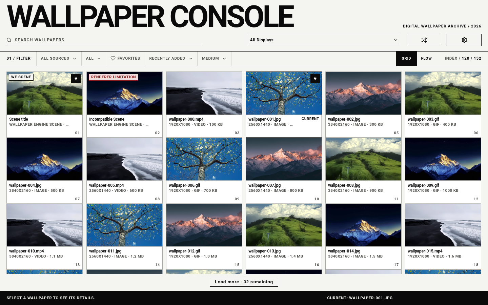
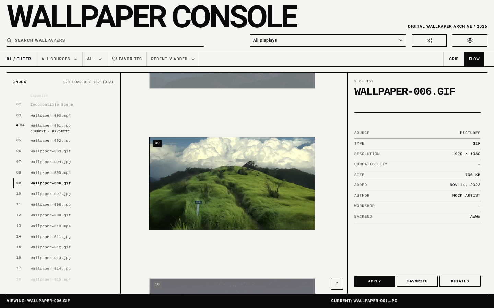

# Wallpaper Console

A Linux wallpaper manager for Wayland. Browse local wallpapers and
supported Wallpaper Engine projects, manage favorites, and apply wallpapers per
display.

## Screenshots

| Grid | Flow |
| --- | --- |
|  |  |

## Features

- Grid and Flow browsing
- Images, GIFs, videos, and compatible Wallpaper Engine scenes
- Multiple folders, favorites, and explicit display subsets
- Optional wallpaper restore after login
- Optional post-apply command for tools such as matugen

Wallpaper Engine Web projects can be browsed, but live Web wallpapers are not
supported. Scene rendering may differ from the original Wallpaper Engine output.

## Install

Download the AppImage, optional CLI bundle, and `SHA256SUMS` from the
[latest release](https://github.com/ZChenW/wallpaper-console-rust/releases/latest).

```bash
sha256sum -c SHA256SUMS
chmod +x wallpaper-console_0.1.6_x86_64.AppImage
./wallpaper-console_0.1.6_x86_64.AppImage
```

The AppImage contains the GUI. Install the CLI for login restoration and terminal
commands:

```bash
tar --zstd -xf wallpaper-console-cli_0.1.6_x86_64.tar.zst
install -Dm755 \
  wallpaper-console-cli_0.1.6_x86_64/wallpaper-console-rust \
  "$HOME/.local/bin/wallpaper-console-rust"
```

The release supports Linux x86_64. Wallpaper renderers are separate host tools;
install only those needed for your desktop and media:

- `awww` — Wayland images and GIFs
- `swaybg` — Wayland static images
- `mpvpaper` — Wayland images, GIFs, and videos
- `linux-wallpaperengine` — compatible Wallpaper Engine scenes

### Independent displays

Use the display selector to choose one output, several outputs, or All. Stop and
Restore act on that selection. **Selected display settings** changes only edited
fields; mixed values and unselected displays keep their own settings. Global
renderer settings are defaults, not a rewrite of saved display recipes.

```bash
wallpaper-console-rust apply /absolute/path/wallpaper.png --target eDP-1 --target DP-8
wallpaper-console-rust stop --target DP-8
wallpaper-console-rust restore-displays --target DP-8
```

Stop retains saved settings but cancels automatic recovery for that output in
the current session. Explicit Apply or Restore enables recovery again. Failed
switches report whether the old wallpaper was unchanged, restored, or still
needs recovery; restoration of the old wallpaper does not count as a successful
new Apply.

Mixed awww/LWE and swaybg pairs are conditional on verified niri support;
awww sharing additionally requires the supported default, alpha-capable daemon.
swaybg currently requires niri surface observation. Sway and Hyprland have output
discovery/recovery adapters but their new mixed-renderer combinations remain
unverified. X11/Xorg and feh are not supported. Existing feh preferences and saved
wallpaper assignments are retained, but cannot be applied or restored. Choose a
Wayland image renderer in Settings (or `config-set image_backend awww`) and
explicitly apply a wallpaper to replace an old assignment. No automatic renderer
substitution or assignment deletion is performed.

Animated PNG/APNG and WebP use mpvpaper; AVI and FLV are accepted only after actual
codec preflight. TIFF, AVIF, HEIC and SVG remain unavailable with the bundled
decoder set. Web rendering is a separate milestone; Application projects never
execute arbitrary project binaries.

## Build from source

Building requires Rust 1.88+, Node.js 22.6+, the
[Tauri 2 system dependencies](https://v2.tauri.app/start/prerequisites/), and a
folder picker such as `zenity`, `kdialog`, or `yad`.

```bash
git clone https://github.com/ZChenW/wallpaper-console-rust.git
cd wallpaper-console-rust
./install.sh
```

To install downloaded release assets without compiling, put the matching
AppImage, CLI archive and `SHA256SUMS` in one directory, then run from this checkout:

```bash
./install.sh --release-dir ~/Downloads/Wallpaper-Console
```

This verifies both assets and installs the same menu entry and managed launchers.
The release launcher extracts into a cache keyed by the AppImage checksum, so it
does not need FUSE or `fusermount`. Reuse the command with newer verified assets
to upgrade. `./install.sh --uninstall` removes unchanged installer-owned files;
settings and the extracted cache are preserved. Installation checks command
availability, not actual rendering: add a folder and apply a wallpaper to verify
your desktop. If no folder picker is installed, use **Enter path** in Sources.

The installer uses `~/.local` by default. Launch it from the application menu or
run `wallpaper-console-gui-rust`.

## Optional automation

Restore the previous wallpaper after login:

```bash
wallpaper-console-rust config-set restore_on_login on
```

Turning the setting on (GUI or `config-set`) installs an XDG autostart entry that
runs `wallpaper-console-rust restore-at-login` when the desktop session starts.
Turning it off removes that entry. Compositors that ignore XDG autostart still
need an explicit startup line for the same command.

Starting the updated GUI or CLI also repairs the autostart registration for
existing configurations. Registration does not immediately change the wallpaper.
A failed registration leaves a settings update unsaved; retrying the same value
repairs missing entries. The desktop session must support XDG autostart.

Enable the post-apply hook (Waypaper-style: opt-in command after apply). Defaults
are **off** and an **empty** command — nothing runs until you configure both.

Matugen example:

```bash
wallpaper-console-rust config-set post_apply_enabled on
wallpaper-console-rust config-set post_apply_command 'matugen image "$WCR_STILL" --prefer saturation'
```

WC manages wallpaper selection and application; your command owns palette
preferences, templates, and desktop reloads. Commands execute as your user through
`sh -c`, with no interactive stdin and a configurable timeout (default 30 seconds).

The **post-apply interface v1** supplies these environment variables, always set
(unavailable optional values are empty):

| Variable | Meaning |
| --- | --- |
| `WCR_HOOK_VERSION` | `1` |
| `WCR_REASON` | `apply`, `restore`, or `retry` |
| `WCR_WALLPAPER` | Wallpaper selected as the theme source |
| `WCR_STILL` | Source image/GIF, extracted video frame, or WE Scene preview |
| `WCR_FILE_TYPE` / `WCR_BACKEND` | Theme source type and renderer |
| `WCR_OUTPUTS` / `WCR_OUTPUT` | Comma-separated affected outputs; legacy `*` means all |
| `WCR_THEME_SOURCE_OUTPUT` | Output selected by the theme-source policy |
| `WCR_THEME_MANIFEST` | Path to version 1 `theme-state.json`, when per-output data exists |

Quote paths, e.g. `"$WCR_STILL"`. Legacy `$still`, `$wallpaper`, `$path`, `$backend`,
`$outputs`, `$manifest`, and `$theme_source` remain available as shell variables.
Paths are no longer substituted into shell source: single quotes now correctly
keep variable names literal. Scripts should use the versioned `WCR_*` variables.
WE Web/Application actions are skipped; a missing Scene preview or extraction
failure is reported. Scene previews do not represent live rendered frames.

```bash
wallpaper-console-rust post-apply-status
wallpaper-console-rust post-apply-retry
```

Status and retry print JSON with `version`, `status`, `detail`, `reason`, and
`finishedAt` (Unix seconds). Status is `disabled`, `skipped`, `succeeded`, `failed`,
or `timed_out`. Retry returns a nonzero exit status unless the command succeeds.
Retry uses the last published wallpaper context and the currently saved command;
it may change theme files, but never applies or restarts wallpaper renderers.
Command success does not prove that desktop components reloaded their themes.
The theme manifest describes wallpaper inputs, not action success. Unknown extra
fields may be added within v1; consumers must check the version and ignore them.

For multi-monitor **focus-follow** (precompute palettes on apply, swap on
focus with no matugen), see `examples/theme-focus-follow/`. WC always writes
`theme-state.json` on successful apply when per-output data is available;
set `post_apply_theme_source` to `last_applied`, `focused`, or `output:<name>`,
and optionally `post_apply_on_restore on` (default) so restore republishes
themes.

## Troubleshooting

If the GUI opens as a blank window because of WebKitGTK rendering issues, try:

```bash
WCR_WEBKIT_DISABLE_DMABUF_RENDERER=1 ./wallpaper-console_0.1.6_x86_64.AppImage
```

There is no automatic updater. Download and verify newer release assets before
replacing existing files.

For a source installation, update or uninstall with:

```bash
git pull --ff-only && ./install.sh
./install.sh --uninstall
```

Settings and the wallpaper library are preserved when uninstalling.

## License

[MIT](LICENSE)

### Library keyboard controls

In Grid, Enter or Space selects and applies the focused wallpaper. In Flow, Enter or Space selects the FlowAnchor first; pressing again applies it. Ctrl/Meta+Enter applies directly in Flow. Moving through Flow does not change Selected. Both views support the Context Menu key and Shift+F10 for wallpaper actions.
